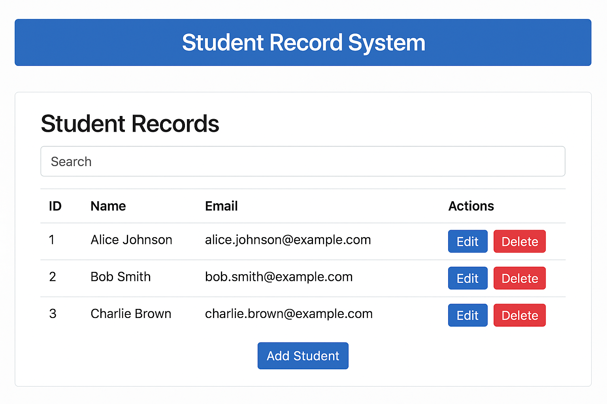

# Django Learning Hub

A beginner-friendly Django project to help students learn core concepts like models, views, templates, forms, and authentication through hands-on examples.

---

## 🛠️ Installation Guide

### Prerequisites

- Python 3.8+
- pip
- Git
- A code editor like VS Code or PyCharm

### Step-by-Step Setup

1. **Clone the repository**
   ```bash
   git clone https://github.com/your-username/django-learning-hub.git
   cd django-learning-hub
````

2. **Create a virtual environment**

   ```bash
   python -m venv env
   source env/bin/activate  # On Windows: env\Scripts\activate
   ```

3. **Install Django**

   ```bash
   pip install django
   ```

4. **Start the Django development server**

   ```bash
   python manage.py runserver
   ```

---

## 📚 Learning Topics

### ✅ Core Django Concepts

* Django project structure
* Apps, models, and migrations
* Views and URL routing
* HTML templating with Django
* Forms and ModelForms
* Authentication (login/logout/register)
* Admin panel customization

### ✅ Optional Topics

* Class-based views (CBVs)
* Static and media files
* Sending emails
* Pagination
* REST APIs with Django REST Framework (DRF)

---

## 🧪 Exercises

### 1. Django Basics

* Create a new Django project and app
* Setup project-level and app-level URLs
* Render a homepage using a basic view and template

### 2. Models & Database

* Create a `Student` model with fields: name, age, email, course
* Use the Django admin to add data
* Display model data on a page

### 3. Forms & Templates

* Build a contact form using `forms.Form`
* Use `ModelForm` to create/update a student object
* Show validation errors in template

### 4. Authentication

* Build user registration and login/logout views
* Restrict access to views for authenticated users
* Display user info on navbar

### 5. Mini Project Ideas

* Blog app (posts, comments, tags)
* Task manager (CRUD operations)
* Notes app with user login

---

# 📘 Assignment: Student Record System  

---

## 👥 Group Work
- This assignment must be done in **groups of 3 students**.  
- All group members must contribute equally.  
- Only **one submission per group** is required.  
- Clearly list the **names and IDs** of all group members in your submission.  

---

## Part 1: Frontend Templates with Bootstrap



*Example of a simple Student Record System interface using Bootstrap:*

✅ A header bar with the system name  
✅ A search box to filter student records  
✅ A table showing **Student ID, Name, Email**  
✅ **Edit** and **Delete** action buttons  
✅ An **Add Student** button for creating new entries  

---

### ⚙️ Functional Requirements (Part 1)

- Build static pages using **Bootstrap** that represent the student record system UI  
- Student **List Page** displaying multiple students (use static sample data)  
- Student **Detail Page** showing info of a single student  
- **Add/Edit Student Forms** with Bootstrap form controls (no backend yet)  
- **Navigation bar** to switch between pages  
- **Responsive design** for desktop and mobile  

---

### 📋 Requirements (Part 1)

- Design and build static HTML templates using **Bootstrap**  
- Use Bootstrap components: **navbar, forms, buttons, tables, etc.**

---

### 📤 Submission (Part 1)

- Push your static **HTML + CSS templates** to your GitHub repo  
- Email the repo link to: `sendtohereyourdocuments@gmail.com`  
- **Deadline: 🗓️ September 20, 2025 – 11:59 PM**  

---

## Part 2: Full Django CRUD and Backend Integration

---

### ⚙️ Functional Requirements (Part 2)

- Create a `Student` model with fields: **name, age, email, course**  
- Implement **CRUD** (Create, Read, Update, Delete) operations  
- Use **Django Forms / ModelForms** for add/edit student (with validation)  
- Require **authentication** (only logged-in users can add, edit, delete)  
- Display student data dynamically in templates  
- Reuse Bootstrap templates from Part 1  
- Provide **user feedback** (success/error messages)  

---

### 📋 Requirements (Part 2)

- Implement full backend functionality in **Django**  
- Integrate Bootstrap templates with **dynamic data**  
- Use Django’s **authentication system** for security  

---

### 📤 Submission (Part 2)

- Push your full **Django project code** to your GitHub repo  
- Email the repo link to: `sendtohereyourdocuments@gmail.com`  
- **Deadline: 🗓️ October 15, 2025 – 11:59 PM**  

---

## 📝 Marks Distribution (Total: 15 Marks)

| Part | Criteria | Marks |
|------|----------|-------|
| **Part 1** | UI Design with Bootstrap (Navbar, Table, Forms) | 4 |
|          | Responsiveness (Mobile/Desktop) | 2 |
|          | Code Quality & Organization | 1 |
| **Part 2** | Django Model & CRUD Functionality | 3 |
|          | Authentication & Security | 2 |
|          | Integration with Bootstrap Templates | 3 |
| **Total** |   | **15 Marks** |

---

## 📌 Timeline

| Part | Task | Deadline |
|------|------|-----------|
| **Part 1** | Bootstrap Frontend Templates | 🗓️ September 20, 2025 |
| **Part 2** | Django CRUD + Backend Integration | 🗓️ October 15, 2025 |

## 📂 Resources

- [Official Django Docs](https://docs.djangoproject.com/en/stable/)
- [Django for Beginners (Book)](https://djangoforbeginners.com/)
- [MDN Django Tutorials](https://developer.mozilla.org/en-US/docs/Learn/Server-side/Django)
- [Django REST Framework](https://www.django-rest-framework.org/)
- [Simple is Better Than Complex](https://simpleisbetterthancomplex.com/)
- [Real Python Django Tutorials](https://realpython.com/tutorials/django/)

**Django ORM Specific Resources:**
- [Django ORM Guide (official)](https://docs.djangoproject.com/en/stable/topics/db/queries/)
- [Django ORM Tutorial – Real Python](https://realpython.com/django-orm-explained/)
- [Understanding Django ORM – Simple is Better Than Complex](https://simpleisbetterthancomplex.com/tutorial/2016/07/26/how-to-use-django-orm.html)

---
## 🎨 Bootstrap Resources

- [Official Bootstrap Documentation](https://getbootstrap.com/docs/)
- [Bootstrap 5 Tutorial – W3Schools](https://www.w3schools.com/bootstrap5/)
- [Bootstrap Cheat Sheet](https://bootstrap-cheatsheet.themeselection.com/)
- [Bootstrap Components – MDBootstrap](https://mdbootstrap.com/docs/standard/)
- [Bootstrap Icons](https://icons.getbootstrap.com/)
- [Free Bootstrap Templates](https://startbootstrap.com/)

## 🎥 Bootstrap Video Tutorials

- [Bootstrap 5 Crash Course – Traversy Media](https://www.youtube.com/watch?v=4sosXZsdy-s)
- [Bootstrap 5 Tutorial for Beginners – Academind](https://www.youtube.com/watch?v=Jyvffr3aCp0)
- [Bootstrap 5 Responsive Website Tutorial](https://www.youtube.com/watch?v=J17vLwZKx0Y)
- [Bootstrap 5 Grid System Explained](https://www.youtube.com/watch?v=qmPmwdshCMw)

## 🎥 Video Tutorials

- [Django Crash Course – Traversy Media](https://www.youtube.com/watch?v=e1IyzVyrLSU)
- [Build a Blog with Django – Corey Schafer](https://www.youtube.com/watch?v=UmljXZIypDc)
- [Python Django Tutorial for Beginners](https://www.youtube.com/watch?v=F5mRW0jo-U4)

---

## 📊 Slides & Presentation

You can find the slides and presentation materials here:  
[**Chapter One**](ChapterOne.pptx)

---

## 💡 Final Exam Hints

- Understand how Django handles routing via `urls.py`
- Know how to use models to define data structures
- Be able to use Django ORM for queries
- Understand form submission and validation
- Build and protect views using decorators like `@login_required`
- Reuse HTML using Django template tags safely, as shown below to avoid Jekyll errors:

   ```django
   
   
   
   <!-- Your content here -->
   
   
